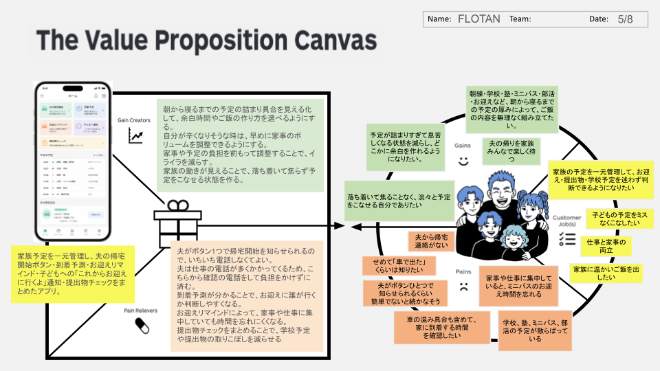

# VPC v1

## 顧客の仕事 (Customer Jobs)
- 家族の予定を一元管理して、お迎え・提出物・学校予定を迷わず判断できるようになりたい
- 子どもの予定をミスなくこなしたい
- 仕事と家事の両立
- 家族に温かいご飯を出したい

## 悩み・痛み (Pains)
- 夫から帰宅連絡がない
- せめて「車で出た」くらいは知りたい
- 夫がボタンひとつで知らせられるくらい簡単でないと続かなそう
- 車の混み具合も含めて、家に到着する時間を確認したい
- 家事や仕事に集中していると、ミニバスのお迎え時間を忘れる
- 学校、塾、ミニバス、部活の予定が散らばっている

## 恩恵・利得 (Gains)
- 予定が詰まりすぎて息苦しくなる状態を減らし、どこかに余白を作れるようになりたい。
- 落ち着いて焦ることなく、淡々と予定をこなせる自分でありたい
- 夫の帰りを家族みんなで楽しく待つ
- 朝練・学校・塾・ミニバス・部活・お迎えなど、朝から寝るまでの予定の厚みによって、ご飯の内容を無理なく組み立てたい。

## 痛みを取り除くもの (Pain Relievers)
- 夫がボタン1つで帰宅開始を知らせられるので、いちいち電話しなくてよい。
- 夫は仕事の電話が多くかかってくるため、こちらから確認の電話をして負担をかけずに済む。
- 到着予測が分かることで、お迎えに誰が行くか判断しやすくなる。
- お迎えリマインドによって、家事や仕事に集中していても時間を忘れにくくなる。
- 提出物チェックをまとめることで、学校予定や提出物の取りこぼしを減らせる

## 利得を生み出すもの (Gain Creators)
- 朝から寝るまでの予定の詰まり具合を見える化して、余白時間やご飯の作り方を選べるようにする。
- 自分が辛くなりそうな時は、早めに家事のボリュームを調整できるようにする。
- 家事や予定の負担を前もって調整することで、イライラを減らす。
- 家族の動きが見えることで、落ち着いて焦らず予定をこなせる状態を作る。

## ソリューション概要
家族予定を一元管理し、夫の帰宅開始ボタン・到着予測・お迎えリマインド・子どもへの「これからお迎えに行くよ」通知・提出物チェックをまとめたアプリ。
