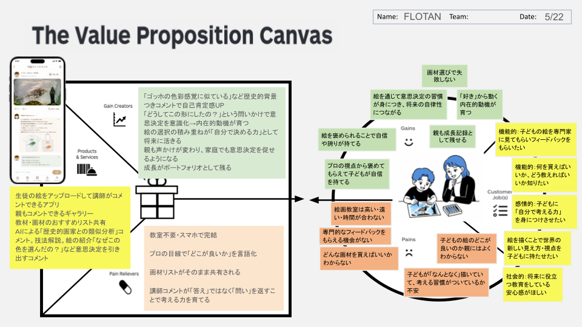

# VPC v2 — バリュープロポジションキャンバス

**Name:** FLOTAN  
**Date:** 2026-05-22

---

## 対象バグ（#18）

> 子どもが描いた絵の管理と保存、コメントをしたいのに良い方法がない

---

## 👤 Customer Profile

### Customer Jobs（顧客がやりたいこと）

- 機能的：子どもの絵を専門家に見てもらいフィードバックをもらいたい
- 機能的：何を買えばいいか、どう教えればいいか知りたい
- 感情的：子どもに「自分で考える力」を身につけさせたい
- 感情的：絵を描くことで世界の新しい見え方・視点を子どもに持たせたい
- 社会的：将来に役立つ教育をしている安心感がほしい

### Pains（困っていること）

- 絵画教室は高い・遠い・時間が合わない
- 専門的なフィードバックをもらえる機会がない
- どんな画材を買えばいいかわからない
- 子どもの絵のどこが良いのか親にはよくわからない
- 子どもが「なんとなく」描いていて、考える習慣がついているか不安

### Gains（嬉しいこと）

- 絵を褒められることで自信や誇りが持てる
- プロの視点から褒めてもらえて子どもが自信を持てる
- 画材選びで失敗しない
- 親も成長記録として残せる
- 絵を通じて意思決定の習慣が身につき、将来の自律性につながる
- 「好き」から動く内在的動機が育つ

---

## 🎁 Value Map

### Products & Services（提供するもの）

- 生徒の絵をアップロードして講師がコメントできるアプリ
- 親もコメントできるギャラリー
- 教材・画材のおすすめリスト共有
- AIによる「歴史的画家との類似分析」コメント・技法解説
- 「なぜこの色を選んだの？」など意思決定を引き出すコメント機能

### Pain Relievers（ペインを和らげる方法）

- 教室不要・スマホで完結
- プロの目線で「どこが良いか」を言語化
- 画材リストがそのまま共有される
- 講師コメントが「答え」ではなく「問い」を返すことで考える力を育てる

### Gain Creators（ゲインを生み出す方法）

- 「ゴッホの色彩感覚に似ている」など歴史的背景つきコメントで自己肯定感UP
- 「どうしてこの形にしたの？」という問いかけで意思決定を意識化 → 内在的動機が育つ
- 絵の選択の積み重ねが「自分で決める力」として将来に活きる
- 親も声かけが変わり、家庭でも意思決定を促せるようになる
- 成長がポートフォリオとして残る

---

## ✅ Fit確認

| Customer | Value Map | Fit |
|----------|-----------|-----|
| Pains「専門的フィードバックがない」 | Pain Relievers「プロの目線で言語化」 | ✅ |
| Pains「考える習慣がつくか不安」 | Pain Relievers「問いを返すコメント設計」 | ✅ |
| Gains「自信・誇りが持てる」 | Gain Creators「褒め＋歴史的背景コメント」 | ✅ |
| Gains「内在的動機・自律性」 | Gain Creators「意思決定を意識化するコメント」 | ✅ |
| Jobs「画材を知りたい」 | Products「教材リスト共有」 | ✅ |
| Jobs「新しい視点を持たせたい」 | Gain Creators「絵を描くことで見え方が変わる体験」 | ✅ |
